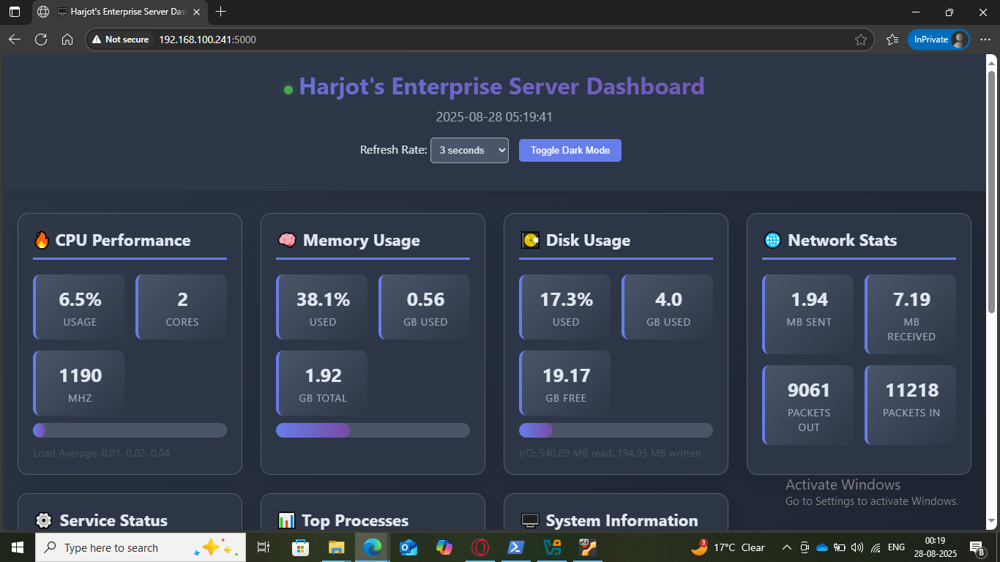

<p align="center">
<span style="font-size:34px; font-weight:bold; color:#C8A2C8;">
Server Monitoring Dashboard
</span>
</p>

---

Started this project because I wanted to get more hands-on experience with Active Directory and server management. Set up a Samba file server and figured I should build something that showcases what I've learned with web development too.

<p align="center">

</p>

---

## Why I built this

Was working on setting up a proper server environment - created directories, user groups, configured bridged networking, got SSH running. After SSH-ing from PowerShell to manage everything, I realized it'd be pretty cool to have a web interface that shows me what's actually happening on the server instead of running commands every time.  
Had some HTML/CSS knowledge already, so I thought why not combine everything into one project that shows off both the sysadmin stuff and web dev skills.

---

## What I learned

- psutil library - had to figure out how to actually grab system metrics with Python  
- JavaScript fetch API - getting data from the backend and updating the DOM  
- CSS Grid/Flexbox - making everything look decent and responsive  
- Server management - chmod/chown for permissions, Apache configuration  
- SSH setup - bridged networking, user management, password policies  

The JavaScript part was definitely a challenge - figuring out how to fetch data from specific IDs and update the interface smoothly took some trial and error. CSS Flexbox was another thing that gave me trouble for a while, getting all the elements to align properly and be responsive.

---

## Features

- Real-time system monitoring (CPU, memory, disk usage, network stats)  
- Service status tracking (Apache, MySQL, SSH, etc.)  
- Running processes viewer  
- System information (uptime, boot time, active users)  
- Dark/light mode toggle - dark mode looks way better imo  
- Auto-refresh with configurable intervals (default 3 seconds)  

---

## Tech Stack

- Backend: Python 3, Flask  
- Frontend: HTML, CSS, JavaScript  
- System Monitoring: psutil library  
- Web Server: Apache  
- Platform: Linux (Ubuntu VM)  

---

## Installation

```bash
git clone [https://github.com/qwertyytrewq001/Enterprise-monitoring-dashboard.git]
cd monitoring-dashboard

pip install flask psutil
python3 monitoring_dashboard.py

Access the dashboard at http://localhost:5000 or http://192.168.100.241:5000 (VM network access)
Current Metrics

CPU performance (usage %, cores, frequency)
Memory usage (used/total RAM, swap)
Disk usage (available space, I/O operations)
Network statistics (packets sent/received, data transfer)
System uptime and boot information

API
GET /api/data - Returns real-time system metrics in JSON format
GET / - Main dashboard interface
Prerequisites

Python 3.x
Linux environment with systemctl access
sudo privileges for service monitoring

Troubleshooting

If services show 'unknown' status, check sudo permissions for systemctl
For network access issues, verify VM bridged networking configuration

Todo

Real-time log monitoring - want to tail system logs and display them
Some charts could be better - thinking about adding graphs for CPU/memory over time
Maybe set up port forwarding for external access
Historical data visualization
Email alerts for high resource usage
More service monitoring options

Notes
Everything's running on the Ubuntu VM I set up, with proper user permissions and SSH access configured. Used sudo nano for most of the coding directly on the server, which was actually pretty convenient once I got used to it.
The CSS Grid layout took some time to get right, especially making it responsive across different screen sizes. The fetch API calls update every few seconds to keep the data current.
Built this to demonstrate both server administration and web development skills. Still adding features as I think of them!